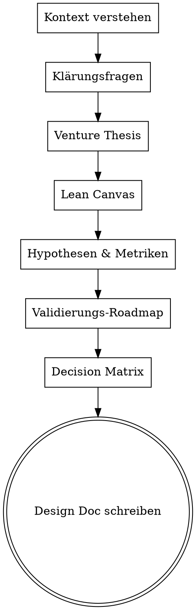

# Business Design Workshop

Interaktiver Workshop der eine Geschäftsidee in ein strukturiertes, testbares Business Design verwandelt. Ergebnis: ein Design Doc mit Venture Thesis, Lean Canvas, Hypothesen, Validierungs-Roadmap und Decision Matrix.

Kommuniziere auf **Deutsch**. Sei analytisch, direkt und pragmatisch.

## Projekt-Kontext

$ARGUMENTS

## Workflow — 5 Sektionen

Führe den User **eine Sektion nach der anderen** durch. Präsentiere jede Sektion, warte auf Approval, dann weiter. Nutze `AskUserQuestion` für strukturierte Entscheidungen — **eine Frage pro Nachricht**.



---

### Schritt 0: Kontext verstehen

Bevor du fragst, lies vorhandene Docs:
- `docs/plans/` — bestehende Design Docs, DD-Ergebnisse
- `CLAUDE.md` — Projekt-Konventionen
- Letzte Git-Commits — aktueller Stand

Dann stelle **Klärungsfragen** (eine pro Nachricht, Multiple Choice bevorzugt):

1. **Vision** — Einmaliger Test oder langfristiges Geschäft?
2. **Revenue Model** — Wie soll Geld verdient werden? (oder: noch unklar?)
3. **Ziel-Output** — Was soll am Ende existieren?
4. **Zielgruppe des Docs** — Für wen ist das Dokument? (intern, Investoren, Sponsoren)

Passe Tiefe und Ton an die Antworten an. "Revenue noch unklar" → kein Zwang zu Revenue-Annahmen. "Für Investoren" → überzeugender Ton mit Marktdaten.

---

### Sektion 1: Venture Thesis

Formuliere basierend auf den Antworten:

- **One-liner:** Ein Satz der das gesamte Vorhaben beschreibt
- **Core Thesis:** 2-3 Sätze die das Marktproblem, die Lösung und die Verbindung zwischen Zielgruppen beschreiben
- **Unfair Advantage:** 2-4 Bullet Points — was hat dieses Venture, das andere nicht haben?

**Präsentiere, warte auf Approval.** Erst dann weiter.

---

### Sektion 2: Lean Canvas

Erstelle eine Lean Canvas Tabelle mit diesen Feldern:

| Feld | Beschreibung |
|---|---|
| **Problem** | Was ist das Kernproblem? Warum existiert es? |
| **Zielgruppen** | Primär + Sekundär (wenn vorhanden, z.B. Nutzer + B2B-Partner) |
| **Value Proposition** | Jeweils für jede Zielgruppe — was ist der konkrete Wert? |
| **Lösung** | Wie wird das Problem gelöst? Konkret, nicht abstrakt. |
| **Kanäle** | Wie erreichen wir die Zielgruppen? |
| **Revenue Streams** | Wie wird Geld verdient? (darf "TBD nach Validierung" sein) |
| **Kostenstruktur** | Was sind die Hauptkosten? |
| **Key Metrics** | Welche Zahlen zeigen ob es funktioniert? |
| **Unfair Advantage** | Warum kann das niemand einfach kopieren? |

**Wichtig:** Lean Canvas statt klassischem BMC — besser für Early-Stage. Felder dürfen "TBD" sein wenn ehrlich noch unklar.

**Präsentiere, warte auf Approval.**

---

### Sektion 3: Hypothesen & Experiment-Metriken

Formuliere **2-5 testbare Hypothesen** als Tabelle:

| # | Hypothese | Pass-Kriterium | Fail-Kriterium | Messmethode |
|---|---|---|---|---|
| H1 | Klare, falsifizierbare Aussage | Konkreter Schwellenwert | Konkreter Schwellenwert | Wie genau wird gemessen? |

**Regeln für gute Hypothesen:**
- Jede Hypothese muss **falsifizierbar** sein — klarer Pass/Fail-Schwellenwert
- Messmethode muss **konkret** sein (DB-Query, Survey-Frage, Analytics-Event)
- Unterscheide **pre-launch Hypothesen** (testbar via LP/Ads) und **post-launch Hypothesen** (testbar erst nach Produkt/Event)
- Sortiere nach Reihenfolge: Was kann man zuerst testen?

**Präsentiere, warte auf Approval.**

---

### Sektion 4: Validierungs-Roadmap

Erstelle eine **3-Phasen-Roadmap**:

#### Phase 1 — "Signal"
- **Ziel:** Nachfrage beweisen mit minimalem Invest
- Konkreter Aktionsplan als Tabelle (Schritt | Aktion | Timeline)
- Geschätzte Kosten für Phase 1
- Welche Hypothesen werden in Phase 1 getestet?
- **Stealth vs. Open Launch:** Empfehle Stealth (kalter Traffic) wenn die Idee noch unvalidiert ist — eigenes Netzwerk erzeugt Bias

#### Phase 2 — "Repeat"
- **Ziel:** Wiederholbarkeit beweisen
- 4-5 Bullet Points: Was passiert wenn Phase 1 erfolgreich?

#### Phase 3 — "Scale"
- **Ziel:** Skalierbares Modell definieren
- 4-5 Bullet Points: Expansion, Revenue-Fixierung, Partnerschaften

**Präsentiere, warte auf Approval.** Passe an wenn der User z.B. Stealth ablehnt.

---

### Sektion 5: Decision Matrix

Erstelle eine Entscheidungsmatrix die **alle realistischen Szenarien** abdeckt:

| Szenario | Hypothese A | Hypothese B | Entscheidung |
|---|---|---|---|
| **Best Case** | Pass | Pass | **Go.** Nächste Phase. |
| **Partial Success A** | Pass | Fail | **Go mit Vorbehalt.** Was anpassen? |
| **Partial Success B** | Fail | Pass | **Pivot.** Was genau pivoten? |
| **Wrong Audience** | Pass (falsche Zielgruppe) | egal | **Pivot Zielgruppe.** |
| **Worst Case** | Fail | Fail | **Kill oder fundamental Pivot.** Post-Mortem. |

Ergänze **Kill-Kriterien** — harte Stopps die verhindern dass Geld verschwendet wird:
- Konkreter Schwellenwert + Zeitrahmen → Stop
- Frühwarnsignal → Sofort Messaging überarbeiten

**Präsentiere, warte auf Approval.**

---

## Nach dem Workshop

### Design Doc speichern

Fasse alle 5 Sektionen in ein Dokument zusammen und speichere es:

```
docs/plans/YYYY-MM-DD-<projektname>-business-design.md
```

Format:
```markdown
# Business Design: [Projektname]

**Date:** YYYY-MM-DD
**Status:** Approved
**Venture:** [Venture Name]
**Audience:** [Für wen ist das Doc?]

---

## 1. Venture Thesis
[...]

## 2. Lean Canvas
[...]

## 3. Hypothesen & Experiment-Metriken
[...]

## 4. Validierungs-Roadmap
[...]

## 5. Decision Matrix
[...]

---

## Validation Tool
[Verweis auf LP/MVP/Experiment das Phase 1 umsetzt]
```

### Commit

```bash
git add docs/plans/YYYY-MM-DD-*-business-design.md
git commit -m "Add [Projektname] business design document"
```

### Nächster Schritt

Frage den User:
> "Business Design steht. Wie willst du weitermachen?"

Optionen:
- **Validation Tool bauen** → Invoke `superpowers:brainstorming` für LP/MVP Design
- **Due Diligence vertiefen** → Invoke `venture-dd` Skill
- **Fertig für jetzt** → Keine weitere Aktion

---

## Wichtige Regeln

1. **Eine Sektion nach der anderen** — nie vorspringen
2. **Jede Sektion einzeln approven lassen** — nicht alles auf einmal
3. **Eine Frage pro Nachricht** — Multiple Choice bevorzugt
4. **Ehrlich bleiben** — "TBD" ist besser als erfundene Annahmen
5. **Hypothesen müssen falsifizierbar sein** — keine weichen Wunschaussagen
6. **Kill-Kriterien sind Pflicht** — jedes Business Design braucht klare Stopps
7. **Lean Canvas statt BMC** — besser für pre-validation
8. **Stealth empfehlen** — eigenes Netzwerk = Bias, kalter Traffic = echtes Signal
9. **Bestehende Docs lesen** — DD-Ergebnisse, vorhandene Plans, CLAUDE.md
10. **Sprache: Deutsch im Gespräch, Englisch im Code/Commits**
